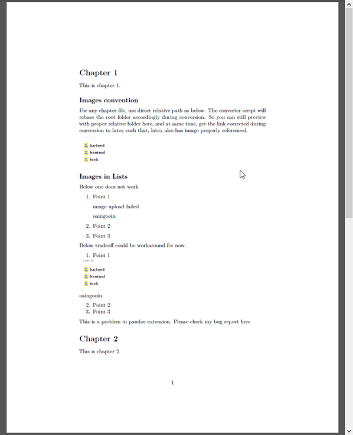
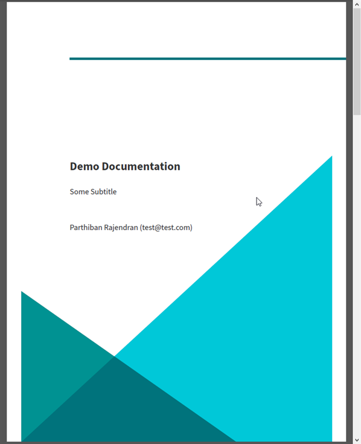
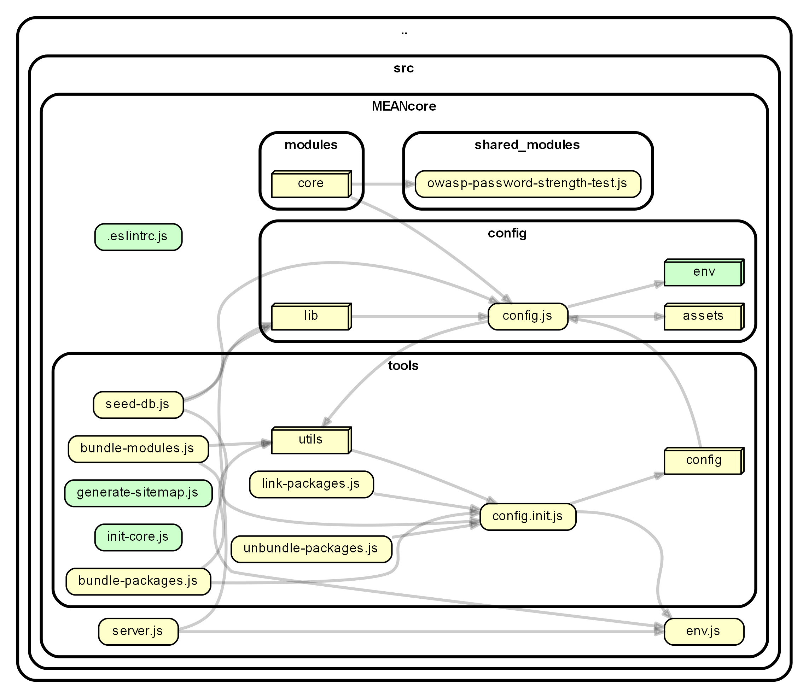

This is a list of scripts one could use for various document generation for their systems engineering. These are the tools I created while contributing to personal/client projects of my own, which I find could be useful to any one who wants to re use. I have mostly tried to re use existing tools, and adapted them to my needs as much as possible. 

I understand the organization here is still a mess. I firstly wanted to get it to a repo so as to use for multiple projects, while also continuing to tweak and include new tools as my needs grow. Please feel free to improvise. 

_Usage:_

Each tool is laid within an example project folder, so as to illustrate how it can be used. So, one could simply align his/her project folder accordingly and use the script (or modify script accordingly). 


##### md2pdf

This converts collection of markdown files to single pdf, typeset by latex engine of choice. The script can be modified to include latex template as well. 

As there is no single universal standard for markdown, this setup is typically hacky. There are few items taht work fine in markdown, but may break in latex. So the final pdf has to be inspected even if no errors thrown by script. 

I have used [pandoc latex template](https://github.com/Wandmalfarbe/pandoc-latex-template) as core base reference here. You could modify the script to either use latex template or not. Please check script for further hints.

_Demo:_

Assuming
* our current folder is `(root folder)`
* md2pdf script path is `(root folder)/tools/md2pdf.sh`

Execute below command in bash shell
```
tools/md2pdf.sh
```

The pdf file can be found in `(root folder)/tools/out` folder. 

| Without Template | With Template |
|---|---|
|  |  |


##### dgraph

This creates a dependency graph for given web stack project. Tested only with `.js`, and `.ts` for now. The script uses [dependency-cruiser](https://github.com/sverweij/dependency-cruiser) with some tweaks. Your tweak could depend on how far and structurally you want to view the files and folders. I wanted a simple high level overview. 

I have used [MEANCore](https://github.com/mrdav30/MEANcore) as source project, a MEAN stack boilerplate.

_Demo:_

Assuming, 
* our current folder is `(root folder)`
* dgraph script path is `(root folder)/tools/dgraph.sh`
* source folders are 1 back from script path, that is, `(root folder)/src`

Execute below command from bash shell
```
tools/dgraphs.sh
```

The image files can be found in `(root folder)/tools/out` folder. Both png and svg are generated for demo.

| Dgraph Demo |
|---|
|  |


##### Tips

* Clean the `desktop.ini` nuisance in your bash script from root folder as below. 

> find -name desktop.ini -delete


