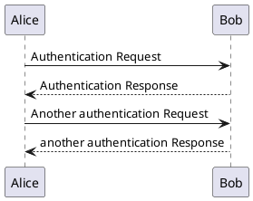

## PlantUML Demo

You can do native plantuml now in our docgen util by including [pandoc-plantuml-filter](https://github.com/timofurrer/pandoc-plantuml-filter) in the script. 

```
    ```plantuml
    @startuml
    Alice -> Bob: Authentication Request
    Bob --> Alice: Authentication Response

    Alice -> Bob: Another authentication Request
    Alice <-- Bob: another authentication Response
    @enduml
    ```
```

The above script could give you



The `@startuml, @enduml` are optional. This has a slight annoyance that, a `plantuml-images` directory would be created along side assets folder, which at the moment I could not customize to redirect in to assets folder. 