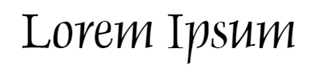

# Chapter 2

This is chapter 2. 

Lorem ipsum dolor sit amet, consectetur adipiscing elit. Phasellus eleifend nulla vel pellentesque varius. Donec vitae fermentum arcu, nec iaculis erat. Etiam tempor ornare odio et rhoncus. Nunc convallis convallis sodales. Lorem ipsum dolor sit amet, consectetur adipiscing elit. Etiam non magna faucibus, pellentesque eros id, varius dolor. Fusce vel tincidunt ipsum. Sed vehicula, massa ut pellentesque rhoncus, tortor nulla sodales nunc, sed bibendum massa enim vitae lorem. Vestibulum vel consectetur enim. Vivamus hendrerit eget sem facilisis lobortis. In auctor risus at placerat feugiat. Duis ultrices lorem eu urna dignissim, ut euismod massa tincidunt. Aliquam consequat sodales nibh ac fermentum. Quisque condimentum augue in lacinia hendrerit.

Sed sed purus rhoncus, mattis nulla at, viverra quam. Integer ante purus, consequat et augue non, venenatis bibendum tortor. Etiam a dapibus velit. Pellentesque non maximus nisi. Aliquam id augue eget urna ultrices iaculis sit amet a tortor. Suspendisse congue ultrices nunc sit amet egestas. In efficitur pulvinar ante, mattis finibus neque sollicitudin at. Integer ligula ex, molestie id arcu in, semper bibendum lacus. Aliquam porttitor justo vel ullamcorper euismod. Curabitur vel erat vestibulum, feugiat massa in, dictum turpis. Sed viverra nisi vel lacus interdum tristique. Donec dignissim rhoncus risus, ut dignissim nulla tristique at. Maecenas rutrum ante maximus sollicitudin semper. Nullam mauris enim, blandit at efficitur vitae, mattis et justo. Ut luctus commodo ultricies.